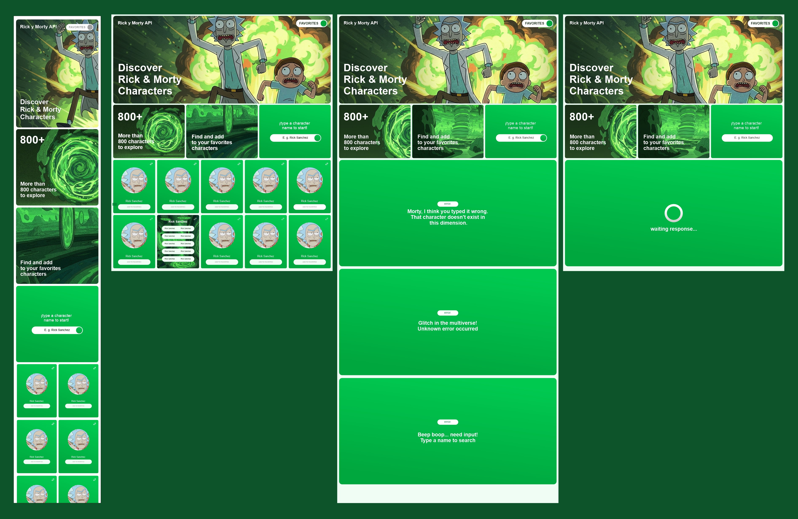

# 🧬 App Rick and Morty — Buscador de Personajes

Aplicación desarrollada para practicar React, consumo de APIs externas, manejo de estado global con Context API, diseño modular, uso de hooks personalizados, persistencia en localStorage y control de errores. Utiliza la API pública de Rick and Morty para buscar y visualizar personajes.

---

## 🛠 Tecnologías utilizadas

- ⚛️ **React (Vite)** — Framework moderno para construir interfaces reactivas y rápidas.
- 💨 **Tailwind CSS** — Framework de utilidades para estilos rápidos y responsivos.
- ⚙️ **Axios** — Cliente HTTP para consumir la API de Rick and Morty.
- 🔄 **Context API + custom hook** — Gestión de estado global mediante `CharacterContext` y `useCharacters`.
- 💾 **localStorage** — Para guardar personajes favoritos de forma persistente.
- 🚦 **Renderizado condicional** — Controlado por `loading`, `error` y `characterList`.

---

## 🌈 Funcionalidades principales

🔍 **Búsqueda de personajes**  
El usuario puede ingresar un nombre para buscar personajes en tiempo real desde la API pública de Rick and Morty.

☁️ **Consumo de API externa con Axios**  
Consulta la API pública y maneja los resultados con validaciones y mensajes de error amigables.

🧠 **Manejo de estados y renderizado condicional**  
- `loading`: muestra animación mientras se obtienen datos.  
- `error`: renderiza errores personalizados si la búsqueda falla o el input está vacío.  
- `characterList`: muestra los resultados cuando hay coincidencias.

📦 **Persistencia con localStorage**  
Los personajes buscados o marcados como favoritos se almacenan localmente en el navegador.

🚫 **Límites definidos en la búsqueda**  
Validaciones para evitar búsquedas vacías, repetidas o fuera de rango.

---

## 🔗 Links

- 🌐 **Live Link**: [Ver proyecto en línea](https://tu-url-aqui.com)

### 🖼️ Prototype | diseño



```bash
npm install
npm run dev
